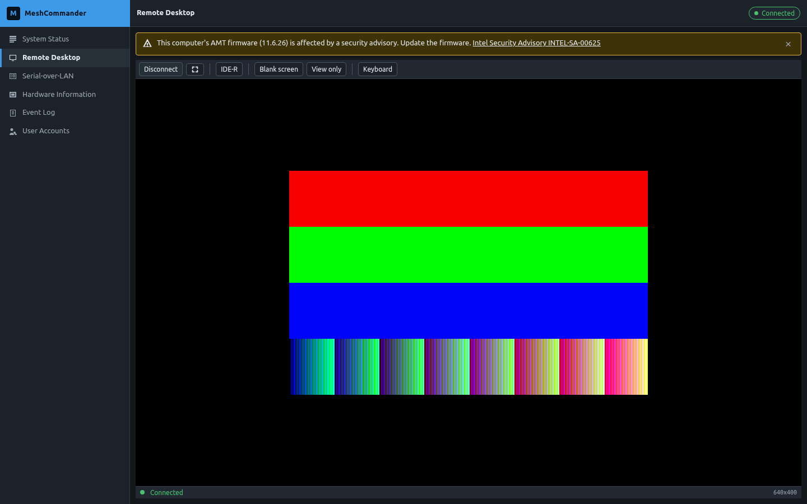
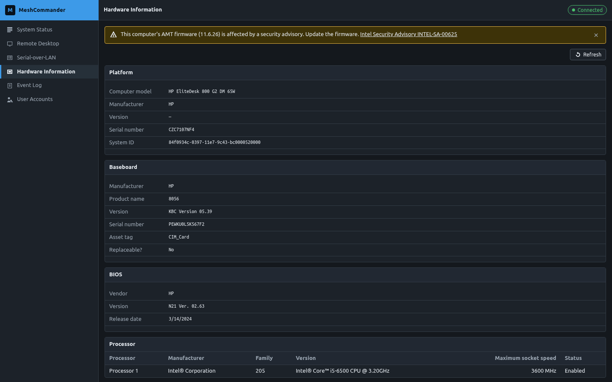

# AMT Commander / MeshCommander


MeshCommander is an Intel(R) Active Management Technology (Intel(R) AMT) remote
management tool: a hardware-KVM remote desktop viewer, a Serial-over-LAN
terminal, IDE-Redirection and much more. It is built on web technologies and runs
on many platforms, and it is deliberately space efficient so that it can be
uploaded into Intel AMT flash space and served by the device's own web server.

This repository is a from-scratch rewrite of the console as a TypeScript/Preact
application, trying to fit into the original size constraints while keeping as many features as possible.

| Path | What it is |
|---|---|
| `apps/console` | The console itself. One Vite build per feature selection, inlined and zopfli-compressed into a single `.htm.gz` small enough for AMT user flash. |
| `apps/site` | The promo site: screenshots, a feature picker with live measured sizes, a theme gallery, a replayed live demo, and the exact CLI command that builds and flashes your selection. It never builds a *custom* artifact — the only thing it compiles is its own demo console, at build time. |
| `packages/build-system` | The feature manifest, the theme registry, the size estimator, the AMT loader and the CLI/TUI picker that builds and flashes. The only thing in the repository that produces an artifact. |
| `packages/mock` | A mock AMT device for development: real captured WSMAN responses, a canned redirection session, and the export that the site's demo replays. |

## Screenshots




## Setup

Everything is a Bun workspace; `bun install` once at the root is all the setup
there is.

```sh
bun run build        # every workspace (default console selection)
                     # plus the promo site, including its demo console
bun run typecheck    # tsc -b across the workspace
bun run console      # the console dev server (proxies /wsman to mock)
bun run mock         # the mock AMT device on :8765
bun run site         # the promo site dev server
```

## Building

Building a custom console — pick features, see what they cost, build it, flash
it — is one command, and it is the same command the promo site hands you:

```sh
bun run cli # interactive picker
bun run cli build --features Desktop,Terminal,IDER --theme midnight
bun run cli install --host 10.0.0.1 -u admin -p secret --name small
```

Sizes shown by the picker are measurements, never guesses: `bun run cli measure`
runs real builds and records them in `apps/console/build/.size-cache.json`.
The full walkthrough, from first build to flashing a device, is in
[docs/building.md](docs/building.md).

The screenshots on the site and the demo console inside it are generated the same
way and committed: `bun run --cwd apps/site shots` re-captures the shots against
the mock device, and `bun run --cwd apps/site build` rebuilds the demo. Both are
worth re-running after a change to the console's chrome.

## Background

The original [MeshCommander](https://github.com/Ylianst/MeshCommander) is developed by [Ylian Saint-Hilaire](https://github.com/Ylianst), a million thanks to him for the original source code!

## Tested on

|Device|State|
|-|-|
|HP EliteDesk 800 G2 Mini|Works fully|

## License

This software is licensed under [Apache 2.0](https://www.apache.org/licenses/LICENSE-2.0).
